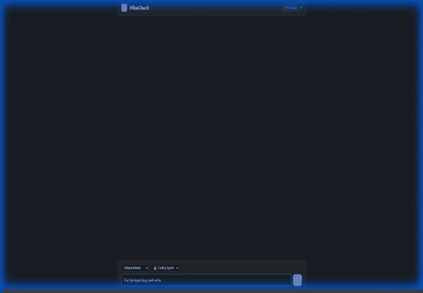

# VibeCheck

> **서버에서 Claude Code를 실행하고, 어디서든 접속하세요.**

[](./README.md)
[](./README_kr.md)
[](https://opensource.org/licenses/MIT)
[](https://www.npmjs.com/package/vibecheck-agent)

VibeCheck은 서버에서 Claude Code 에이전트를 24시간 실행합니다. 노트북, 폰, 태블릿 — 웹 브라우저가 있는 어떤 기기에서든 접속할 수 있습니다. PC가 꺼져 있어도 됩니다. 세션은 기기 간에 이어집니다: PC에서 코딩을 시작하고, 폰에서 이어하고, 노트북에서 다시 확인하세요.

<p align="center">
  
</p>

---

## 왜 VibeCheck인가?

### 서버는 절대 꺼지지 않습니다
Claude Code가 서버에서 백그라운드 서비스로 실행됩니다. 노트북 닫고 퇴근해도 에이전트는 계속 돌아갑니다. 내일 와서 이어서 하면 됩니다.

### 어떤 기기에서든 코딩
브라우저 열고 에이전트에 접속하세요. 데스크탑, 모바일, 웹 브라우저가 있는 모든 기기에서 동작합니다. 앱 설치가 필요 없습니다.

### 세션이 따라옵니다
PC에서 시작한 대화를 폰에서 이어갈 수 있습니다. 모든 Claude Code 프로젝트와 세션을 탐색하세요. 같은 `.jsonl` 히스토리를 공유하기 때문에 CLI와 웹에서 동일한 대화가 보입니다.

---

## 빠른 시작

### 클라우드 (가장 간편)

1. [vibecheck.sotaaz.com](https://vibecheck.sotaaz.com)에서 로그인
2. 서버에서 설치 명령어 실행:

```bash
curl -sL https://vibecheck.sotaaz.com/install/YOUR_API_KEY | bash
```

3. Chat 페이지를 열고 코딩 시작.

### 셀프 호스팅 (무료)

```bash
git clone https://github.com/NestozAI/VibeCheck
cd VibeCheck/self-hosted
./setup.sh
# http://localhost:8501 접속
```

Slack 연동 등 상세 설정은 [셀프 호스팅 가이드](./docs/self-hosted.md)를 참고하세요.

### 에이전트만 설치

```bash
npm i -g vibecheck-agent
vibecheck-agent --key YOUR_API_KEY --dir /path/to/project
```

---

## 주요 기능

### 멀티 디바이스
- **웹 UI** — 브라우저에서 동작하는 풀 채팅 인터페이스, 모바일 지원
- **세션 이어가기** — 어떤 기기에서든 이전 대화를 이어서 진행
- **프로젝트 탐색** — 서버의 모든 Claude Code 프로젝트를 검색하고 전환
- **크로스 디바이스 히스토리** — 웹 대화가 CLI에서 보이고, CLI 대화가 웹에서 보임

### 실시간 코딩
- **스트리밍 응답** — Claude가 생성하는 동안 토큰 단위로 실시간 확인
- **도구 시각화** — Claude의 작업 과정 표시: "파일 읽는 중...", "명령 실행 중...", "코드 수정 중..."
- **이미지 업로드** — 스크린샷과 이미지를 채팅에 드래그 앤 드롭
- **시각적 피드백** — 프로젝트 미리보기 스크린샷 자동 생성

### 에이전트 관리
- **스킬 시스템** — 에이전트 프리셋 전환 (리서치, 코딩, 코드 리뷰, 테스트 등)
- **태스크 스케줄러** — cron으로 반복 작업 자동화 (매일 git pull, 주간 감사)
- **모델 선택** — 쿼리별 Claude 모델 지정 (Opus, Sonnet, Haiku)
- **커스텀 서브에이전트** — 멀티에이전트 워크플로우용 전문 에이전트 정의
- **비용 추적** — 모든 응답에 USD 비용 및 토큰 상세 표시

### 보안
- **경로 기반 접근 제어** — 기본적으로 작업 디렉토리만 신뢰
- **승인 UI** — 샌드박스 밖 경로 접근 시 승인/거부 선택
- **자동 재시작** — 에이전트 패키지 업데이트 시 서비스 자동 재시작

---

## 동작 방식

```
┌─────────────┐     ┌──────────────────┐     ┌─────────────────┐
│    폰       │────▶│  VibeCheck 서버   │◀────│   노트북/PC     │
│  (브라우저)  │     │  (WebSocket 허브) │     │  (브라우저/CLI)  │
└─────────────┘     └────────┬─────────┘     └─────────────────┘
                             │
                    ┌────────▼─────────┐
                    │    서버          │
                    │  vibecheck-agent  │
                    │  (Claude Code)   │
                    └──────────────────┘
```

에이전트는 [Claude Agent SDK](https://github.com/anthropics/claude-agent-sdk)를 통해 Claude Code를 실행합니다. WebSocket으로 서버에 연결되고, 웹 클라이언트도 같은 서버에 연결됩니다. 메시지가 양방향으로 실시간 전달됩니다.

세션 히스토리는 `~/.claude/projects/`에 `.jsonl` 파일로 저장됩니다 — Claude Code CLI와 동일한 형식입니다. 따라서:
- 웹에서 시작한 세션이 `claude` CLI에서 보입니다
- CLI에서 시작한 세션을 웹에서 이어갈 수 있습니다
- 프로젝트 탐색으로 모든 프로젝트의 세션을 검색할 수 있습니다

---

## 대안 비교

| | **VibeCheck** | **Happy Coder** | **SSH** |
|---|---|---|---|
| Claude 실행 위치 | **서버** (headless, 24/7) | 내 PC (켜져 있어야 함) | 내 PC |
| 접속 방법 | 아무 브라우저 | 모바일 앱 전용 | 터미널 전용 |
| PC 꺼도 작동? | **가능** | 불가 | 불가 |
| 설치 | `npm i -g` + 한 줄 명령 | `npm i -g` + 래퍼 실행 | 해당 없음 |
| 세션 공유 | 웹 + CLI가 `.jsonl` 공유 | 모바일이 PC 세션 제어 | 해당 없음 |
| 오픈소스 | MIT | MIT | 해당 없음 |
| 앱 필요? | 불필요 (웹 브라우저) | 필요 (iOS/Android) | 불필요 |

---

## 스킬

| 스킬 | 허용 도구 | 용도 |
|------|----------|------|
| 리서치 에이전트 | Read, Grep, Glob, WebSearch, WebFetch | 코드베이스 분석, 정보 수집 |
| 코딩 에이전트 | 전체 | 코드 작성 및 수정 |
| 코드 리뷰 | Read, Grep, Glob | 버그, 보안, 품질 검토 |
| 테스트 실행 | Read, Glob, Bash | 테스트 실행 및 요약 |
| 의존성 감사 | Read, Glob, Bash | 취약점 및 업데이트 확인 |
| Git 요약 | Read, Bash | 커밋 히스토리 요약 |
| 문서 작성 | Read, Write, Glob | README 및 인라인 문서 |

---

## 파일 구조

```
VibeCheck/
├── cloud/
│   └── agent-ts/              # 클라우드 에이전트 (npm: vibecheck-agent)
│       └── src/
│           ├── agent.ts       # WebSocket 에이전트, 세션 관리
│           ├── claude.ts      # Claude Agent SDK 래퍼
│           ├── sessions-scanner.ts  # 프로젝트 및 세션 탐색
│           ├── skills.ts      # 내장 스킬 프리셋
│           ├── scheduler.ts   # cron 기반 태스크 스케줄러
│           └── security.ts    # 경로 기반 접근 제어
├── self-hosted/               # 셀프 호스팅 서버 + 웹 UI
│   ├── src/
│   │   ├── server.ts          # Express + WebSocket 서버
│   │   ├── core.ts            # 트랜스포트 독립 오케스트레이션
│   │   └── slack/             # Slack 연동 (선택)
│   └── static/index.html      # 웹 채팅 UI
├── assets/                    # README 이미지
├── docs/
│   ├── self-hosted.md         # 셀프 호스팅 설치 가이드
│   └── protocol.md            # WebSocket 프로토콜 레퍼런스
└── README.md
```

---

## 요구 사항

- Node.js 18+
- Claude Code CLI (`claude` 명령어가 PATH에 있어야 함)
- 웹 브라우저

---

## 문제 해결

**에이전트가 연결되지 않나요?**
- API 키가 올바른지 확인
- `claude` CLI가 설치되어 PATH에 있는지 확인
- 방화벽 규칙 확인 (WebSocket 포트가 열려 있어야 함)

**응답이 오지 않나요?**
- 에이전트 프로세스가 실행 중인지 확인 (`systemctl status vibecheck-agent`)
- 에이전트 로그 확인: `journalctl -u vibecheck-agent -f`

---

## 라이선스

MIT

## 기여

이슈나 풀 리퀘스트를 통한 기여를 환영합니다!

---

<p align="center">
  <a href="https://vibecheck.sotaaz.com">
    
  </a>
</p>
